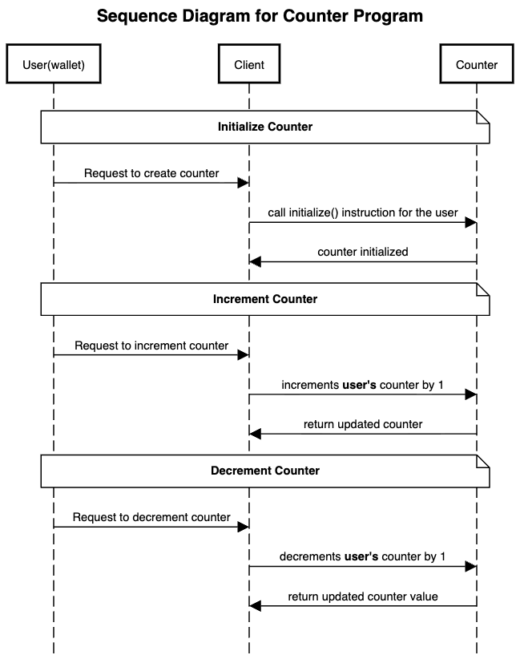

# Solana Counter Program

A decentralized counter application built on Solana using Anchor framework.

## Features

Here are the features implemented in the counter program:-

- ✅ Initialize personal counter accounts
- ✅ Increment counter value
- ✅ Decrement counter value
- ✅ PDA-based account management
- ✅ Authority-based access control
- ✅ Overflow/underflow protection

## Architecture Overview



## User Stories

#### 1: Initialize Personal Counter
**As a** user
**I want to** create my own personal counter account
**So that** I can track the counter numerical value on-chain.

**Acceptance Criteria:**
- I can initialize a counter account with my wallet
- The counter starts at zero(0).
- Only I can control my counter account as the counter is tied to my wallet.

#### 2: Increment Counter
**As a** user
**I want to** increase my counter by 1
**So that** I can track upward progress of my counter  

**Acceptance Criteria:**
- counter is incremented by 1
- only I can increment my counter

#### 3: Decrement Counter
**As a** user
**I want to** decrease my counter by 1
**So that** I can track downward progress of my counter  

**Acceptance Criteria:**
- counter is decremented by 1
- only I can decrement my counter


## Quick Start

```bash
# Install dependencies
npm install

# Build the program
anchor build

# Run tests
anchor test
```
