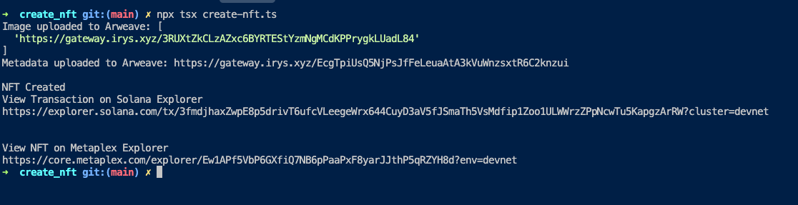
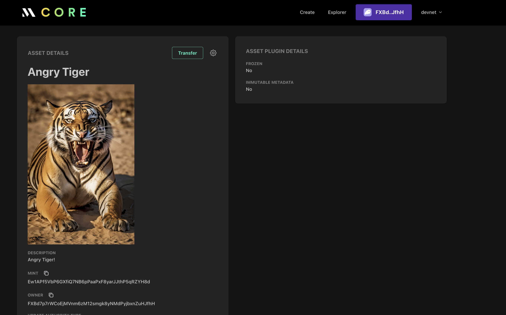

# Create NFT

`create-nft.ts` uploads the sample NFT image and metadata to Arweave, mints the asset on Solana devnet with the local wallet keypair, and prints explorer links for the mint transaction.

### Prepare `wallet_keypair.json`
1. Make sure solana CLI is installed locally if not install it: `sh -c "$(curl -sSfL https://release.solana.com/stable/install)"` and restart your terminal so `solana` is on the PATH.
2. Generate or recover a keypair file:
   - To create a fresh devnet wallet: `solana-keygen new --outfile wallet_keypair.json --no-bip39-passphrase`
   - To use an existing wallet (e.g. Phantom), export the base58 secret key, then run `solana-keygen recover ASK --outfile wallet_keypair.json` and paste the secret when prompted.
3. Verify `wallet_keypair.json` sits alongside `create-nft.ts`; it should contain an array of numbers.

### Prepare NFT assets
1. Place your image inside the `assets/` folder (create it if missing) and note the filename, e.g. `dragon.png`.
2. Update `create-nft.ts`:
   - Change the path in `uploadImageToArweave` function to match the new filename.
   - Adjust the metadata returned by `getMetadata` so `name`, `description`, and `properties.files` reflect your asset and media type.

### Run Locally
- Ensure `wallet_keypair.json` exists at the project root and run `npm install` once.
- Execute `npx ts-node create-nft.ts` from the `create_nft` directory.

## Results

### NFT on metaplex

